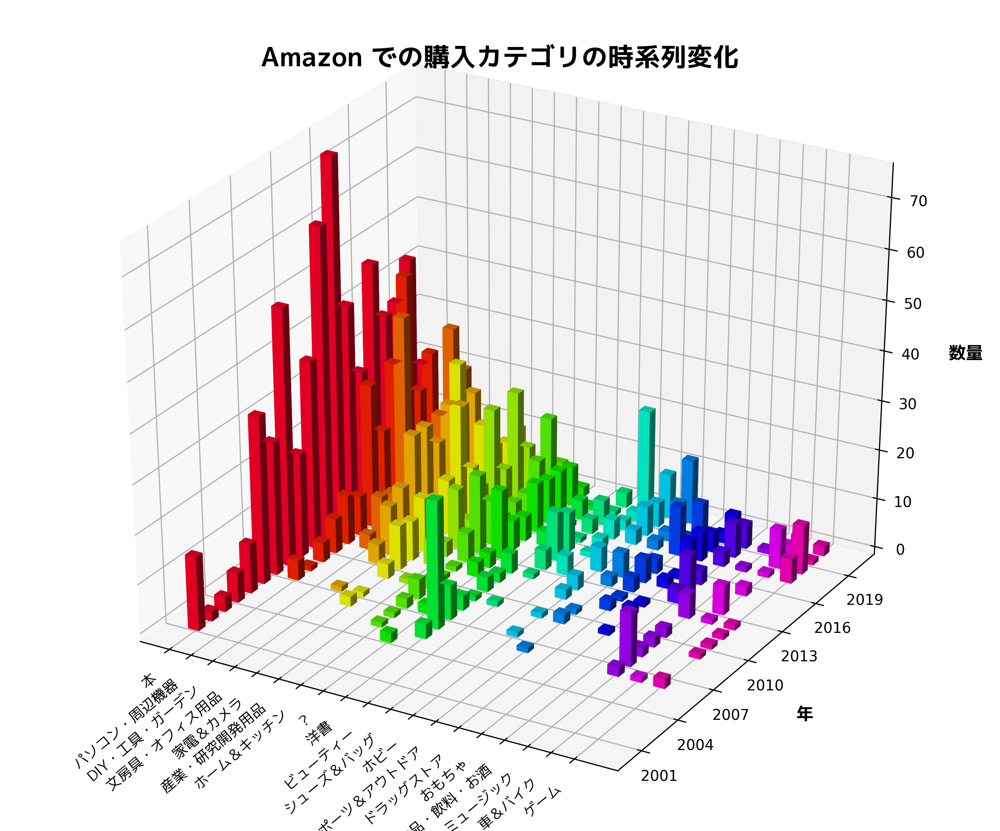

# amazhist

amazhist は，Amazon の買い物履歴情報を取得し，Excel 形式で出力するソフトウェアです．

次のような特徴があります．

- 商品名や価格だけで無く，カテゴリやサムネイル画像も収集
- 収集したデータから Excel ファイルを生成
- 時系列での購入傾向が一目で分かるグラフの自動生成

## 出力サンプル

# スクリプト構成

次の 3 つのスクリプトから構成されています．

## `amazhist.rb`

Amazon にアクセスし，購入履歴情報を収集し，JSON ファイルに保存します．また，商品のサムネイル画像も収集します．

## `amazexcel.rb`

JSON ファイルから，Excel ファイルを生成します．

## `amazgraph.py`

JSON ファイルから，時系列分析グラフを生成します．PNG 画像が生成されます．

# 実行方法

## Windows の場合

`amazhist.exe` を実行した後，`amazexcel.exe` 実行します．

`amazhist.exe` を実行すると Amazon のログイン ID とパスワードを聞かれますので，入力します．
その後実行して良いか聞かれるので問題無ければ ENTER を押します．`amazhist.exe` も同様にします．

購入履歴の量次第ですが，`amazhist.exe` の実行には数時間，`amazexcel.exe` の実行には十分程度かかります．

時系列分析グラフを生成したい場合，`amazgraph.exe` も実行します．

## Linux の場合

### 準備

次のコマンドを実行して必要なモジュールをインストールします．Ubuntu 以外の場合は，最初のコマンドを適宜読み替えてください．

`sudo apt-get install libmagick++-dev`

`bundle install`

### 実行

1. `amazhist.rb` を実行．

2. Amazon のログイン ID とパスワードを入力．(入力後 ENTER を押すことで確定されます．以下同様)

3. 実行して良いか聞かれるので，内容に問題無ければ Y を入力．

4. 履歴情報の収集が始まりますので，終わるまで数時間待ちます．

5. `amazexcel_axlsx.rb` を実行．

6. 実行して良いか聞かれるので，内容に問題無ければ Y を入力．

7. エクセルファイルの生成が始まりますので，終わるまで数十分待ちます．

8. 完了したら，エクセルファイル amazexcel.xlsx が生成されています．

9. 時系列分析グラフを生成したい場合，`amazgraph.py` も実行します．

# Tips

## コマンドラインオプション

引数に -h を指定して実行すると，指定できるオプションが表示されます．
生成されるファイルやディレクトリの名前を変更したいときにお使いください．

## ログイン情報の指定

環境変数 `amazon_id` と `amazon_pass` に Amazon のログイン情報をセットすると，自動的にそれらが使われます．

Linux の場合は次のようにします．

    export amazon_id="Amazon のログイン ID"
    export amazon_pass="Amazon のパスワード"

Windows の PowerShell の場合は次のようにします．

    $env:amazon_id="Amazon のログイン ID"
    $env:amazon_pass="Amazon のパスワード"

## Windows 版の実行ファイルのソース

実行ファイルは OCRA を使って，Ruby スクリプトから生成したものになります．
従いまして，末尾を .rb に置き換えたファイルを参照願います．

## amazexcel.rb と amazexcel_axlsx.rb の違い

amazexcel.rb が生成するファイルには集計シートにグラフが挿入されます．
それ以外は基本的に機能に差はありません．

ただし，amazexcel.rb は動作に際して Win32OLE を使用しています．そのため，実行できるのは Windows に限られます

# ライセンス

Apache License Version 2.0 を適用します．
